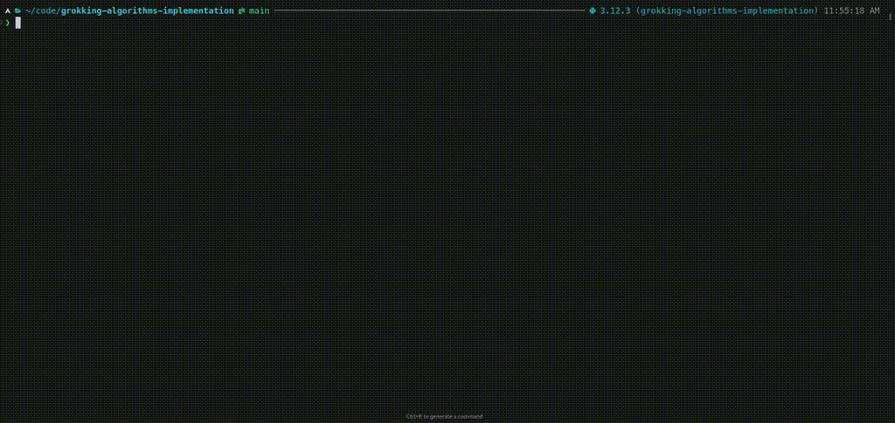

# Grokking Algorithms Implementation

This repository contains implementations of algorithms from the book "Grokking Algorithms" by Aditya Bhargava, along with corresponding unit tests.


## Getting Started

1. Install uv (if not already installed):
   ```
   curl -LsSf https://astral.sh/uv/install.sh | sh
   ```

2. Clone the repository:
   ```
   git clone https://github.com/helioLJ/grokking-algorithms-implementation.git
   cd grokking-algorithms-implementation
   ```

3. Install project dependencies:
   ```
   uv sync
   ```

## Implementing Algorithms

If you want to generate template files from the existing implementations:

1. Ensure you have committed any changes you want to keep.
2. Run the template generation script:
   ```
   uv run python scripts/generate_templates.py
   ```

## Running Tests

To run all tests:
```
uv run pytest
```


To run tests for a specific chapter, navigate to the chapter directory and run:
```python
uv run pytest tests/test_chapterX
```

## Contributing

1. Fork the repository
2. Create a new branch for your feature
3. Implement your changes and add tests if necessary
4. Submit a pull request

## Acknowledgments

- Aditya Bhargava for the book "Grokking Algorithms"
- All contributors to this project